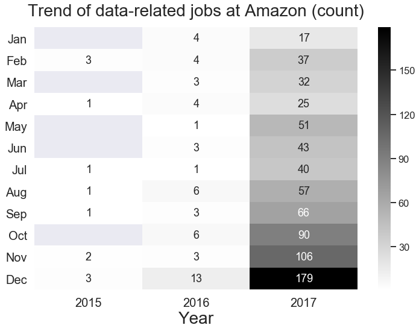
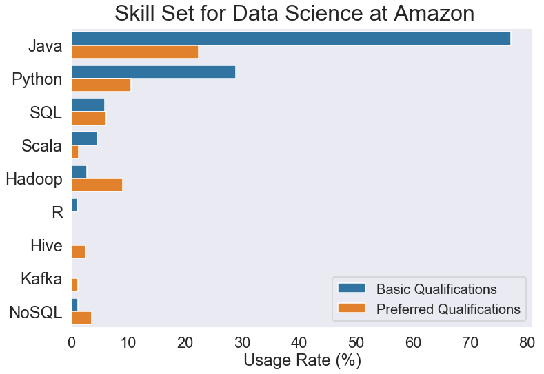
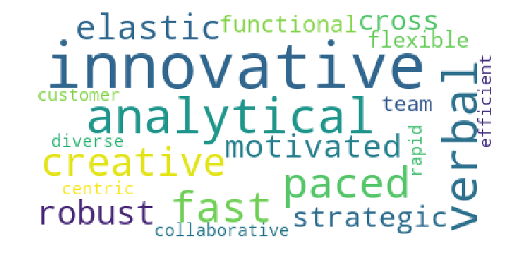

# Strategies-for-Landing-Data-Jobs-at-Amazon
## Table of Contents
1. General Description
2. Dataset Description
3. Research Questions
4. Tech Stack
5. Process

## 1 General Description 
Being part of FLAG is the dream of most new grad students. Then, How to be part of FLAG will be an important question. This project wants to explore what's the best strategies for students of data-related field by analyzing Amazon's Job skills dataset. This investigation is important because it allows new grad students to examine how well they fit to data related jobs in Amazon and also provides actionable insights for appliing jobs in Amazon.

## 2 Dataset Description

Amazon job dataset (Amazon_jobs_database.csv) is collected using Selenium and BeautifulSoup by scraping all of the jobs for Amazon job site from 2014 to 2018.

#### Content of Dataset
- <b>Title</b>: The title of the job
- <b>Location</b>: Location of the job
- <b>Posting_date</b>: Posting date of the job
- <b>Description</b>: Overall description for the job
- <b>Basic Qualifications</b>: Minimum Qualifications for the job
- <b>Preferred Qualifications</b>: Preferred Qualifications for the job

## 3 Research Questions
- What's the trend of Job Description in Amazon? What's the best time period to pursue career in Amazon?
- What's the data-related skills Amazon need?
- What's kind of talent and personality Amazon wants to have?

## 4 Tech Stack
- Matplotlib
- Jupyter Notebook
- seaborn
- pandas
- pyLDAvis
- nltk
- re
- wordcloud
- gensim
- sklearn
- lda

## 5 Process

This project provides three actionable insights, including time, skillset and culture fit. 

### Best Time to Apply

According to this heatmap,  it's obviously the trend of posting jobs at Amazon are:
- Data jobs posted in Amazon was growing from 2015 to 2017.
- The fourth quarter is the best chance to apply Amazon data-related jobs especially in December. December got the maximum of posted jobs from 2015 to 2017.

### Skill Set applicant better have for applying Amazon’s job.

There are some interesting insights in skills:
- Java is dominated skill of data jobs at Amazon.
- R wouldn't make you be a strong applicant for jobs at Amazon. 
- skills, such as Hadoop, Hive, Kafka, NoSQL, increased a lot from Basic requirement to preferred requirement, which means that Amazon hopes talents can handle big data.

If you want to landing jobs at Amazon, prepare-well for Java and skills of big data will make you be a stronger applicant.  

### Culture Fit at Amazon

To better understand personalities that Amazon wants to have, this project extracted the words related to personality by using natural language processing (NLTK). 

The result demonstrates that ideal data person of Amazon is a person who are innovative, analytical thinking, fast paced, elastic, creative and be good at teamwork. Highlight and connect those characteristics with previous working experiece in resume will help to landing jobs at Amazon.
